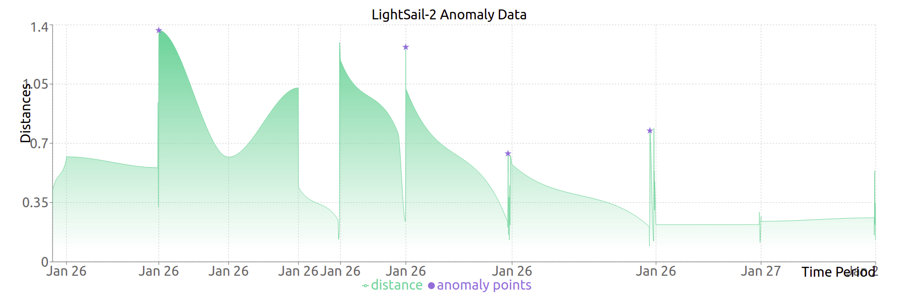

# LighSail-2 Anomaly Detector Graph from 2020-01-21 to 2020-01-28

Notebook to Generate Data is [here](./lightsail-2-analysis.ipynb)

Data Generated is in [src/assets/data.json](./src/assets/data.json)

### Demo Picture

# Getting Started with Webpage

This project was bootstrapped with [Create React App](https://github.com/facebook/create-react-app).

## Pre requisite 
* Node
* Yarn

## Setup Graph
* Go to root directory (/polaris-detect-graph)
* run command `yarn install`
* run command `yarn start`
* Open your browser and go to `localhost:3000`

## Available Scripts

In the project directory, you can run:

### `yarn start`

Runs the app in the development mode.\
Open [http://localhost:3000](http://localhost:3000) to view it in the browser.

The page will reload if you make edits.\
You will also see any lint errors in the console.

### `yarn build`

Builds the app for production to the `build` folder.\
It correctly bundles React in production mode and optimizes the build for the best performance.

The build is minified and the filenames include the hashes.\
Your app is ready to be deployed!

See the section about [deployment](https://facebook.github.io/create-react-app/docs/deployment) for more information.
